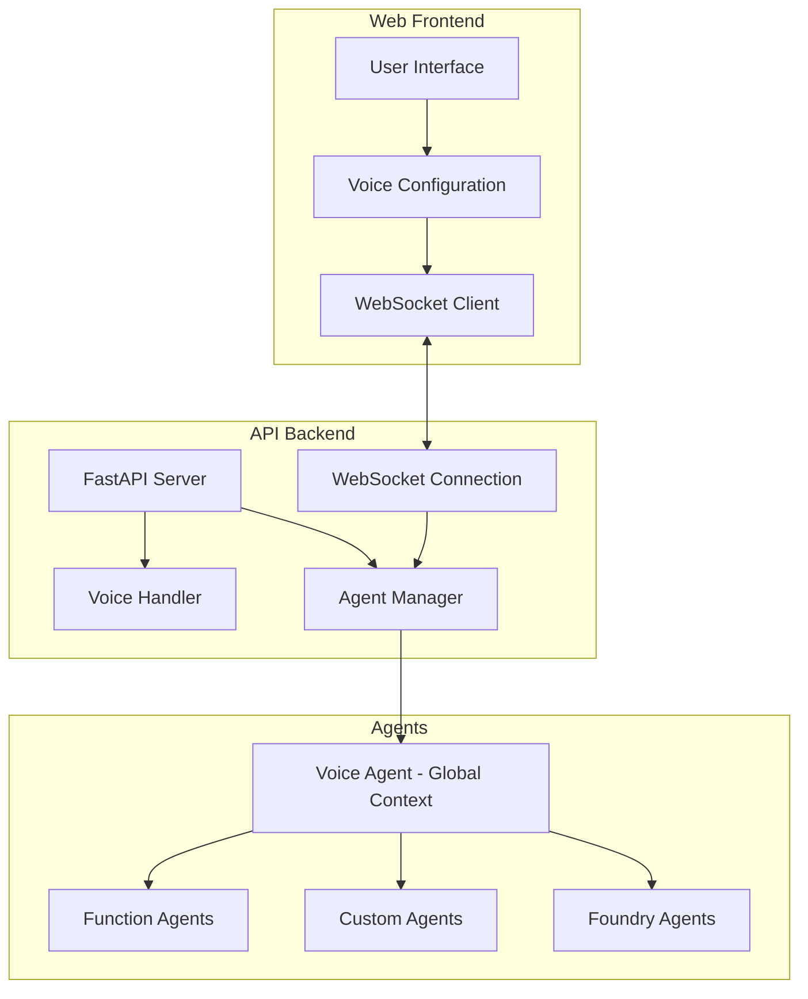

# Sustineo

Sustineo is an agent-based application framework that enables powerful interactions between different types of AI agents. It provides a flexible architecture for connecting and orchestrating various agents, allowing them to collaborate and share information.

- Magic function calling mapping for generic local function calls (A)
- Figure out backchannel with utility function calls (A+S)*

## Architecture

Sustineo is built on a multi-agent architecture with specialized agents working together through a central voice agent that maintains the global context. The system consists of the following components:

### Agent Types

Sustineo supports three types of agents:

1. **Foundry Agents** - External agents hosted on Azure AI Foundry, accessed through the Azure AI Project Client
2. **Custom Agents** - Defined in `.prompty` files and loaded dynamically at runtime
3. **Function Agents** - Python functions decorated with the `@agent` decorator

The Voice Agent serves as the central orchestrator with global context, while other agents provide specialized services with more local contexts.

### System Components

### Communication Patterns

The application follows these communication patterns:

1. **Voice Agent Orchestration** - The Voice Agent has access to the global context and can invoke other agents as tools
2. **Function Calling** - Agents can call functions on other agents through a standardized mechanism
3. **WebSocket Communication** - Real-time communication between the frontend and backend
4. **Agent Configuration** - The Voice Configuration component allows for dynamic selection of which agents to include as tools

### Component Descriptions

- **Voice Agent**: Central agent with global context that orchestrates interactions with other agents
- **Agent Manager**: Handles agent registration, discovery, and execution
- **Voice Configuration**: Allows configuration of the Voice Agent and selection of other agents as tools
- **WebSocket Connection**: Enables real-time communication between clients and agents

### Agent Execution Flow

When an agent is executed:
1. A thread is created for the execution
2. Messages are passed between the client and agent through this thread
3. Results are streamed back to the client in real-time
4. The Voice Agent can make calls to other agents as needed

This architecture allows for flexible, extensible agent interactions while maintaining a central context through the Voice Agent.